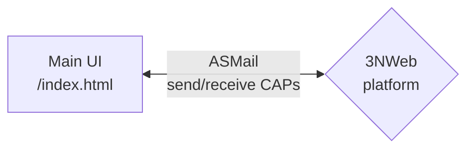

# Inbox 3NWeb app

Inbox app gives an email-style communication.

## Overview



Vue3 framework is used for GUI components. Composition style API of Vue3 allows creating of code that is composable into tests app to run and test different scenarios.

More details are described in [this documentation](./doc/README.md).


## Usage

This uses code base `pnpm`.

Initialize tooling with terminal command:
```bash
pnpm install --frozen-lockfile
```

Build Chat app's `app` folder with:
```bash
pnpm run build
```
`app` folder and `manifest.json` constitute runable 3NWeb app.

