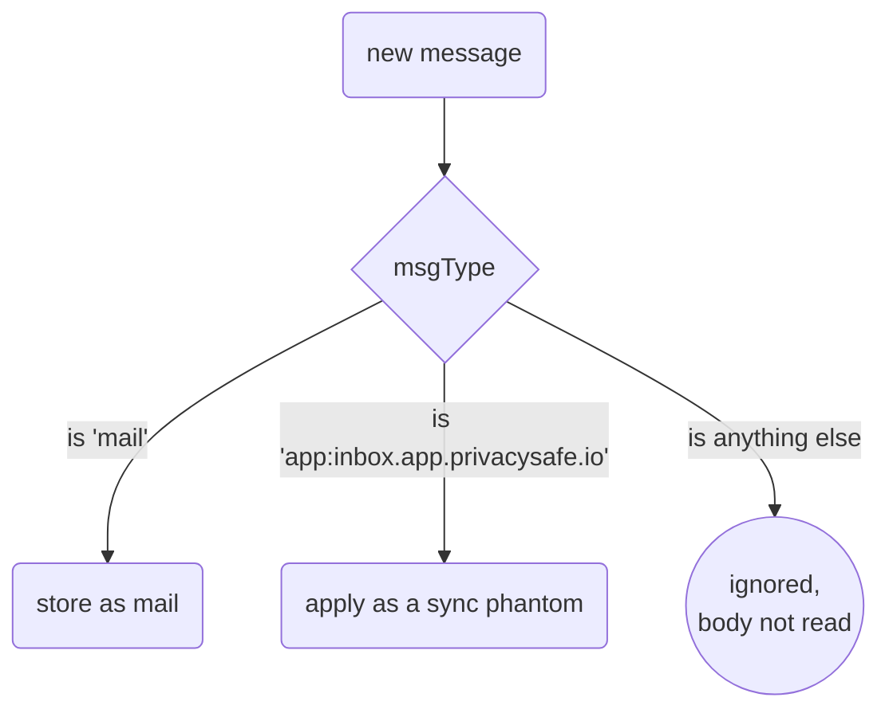
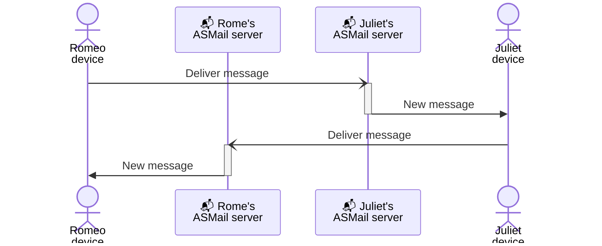

# Chat messages

## Sending/Receiving via ASMail

Inbox app uses value `msgType: 'mail'` in `MsgStruct` part of `OutgoingMessage` and `IncomingMessage`.

It also uses a second type, `msgType: 'app:inbox.app.privacysafe.io'`, for the
*phantoms* it sends to the user's own address to synchronize the user's devices
(see [multi-device-sync.md](./multi-device-sync.md)). `app:<app domain>` is the
platform's convention for messages of an application rather than of a user; the
core routes nothing by `msgType`, so builds that predate the feature filter such
a message out and ignore it rather than showing it to the user.

An inbox message is routed by its type in one place, `routeIncomingMsg()`. Every
other type - `'chat'`, `'webrtc-signaling'`, another app's `app:*` - is left
alone and **not removed**: the inbox is shared not only between the user's
devices, but between their applications.

## Message sending, receiving process

