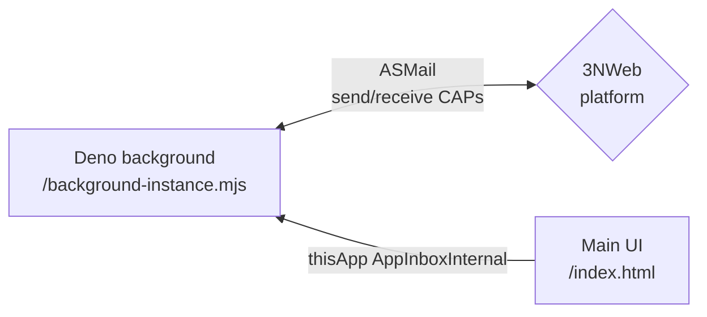
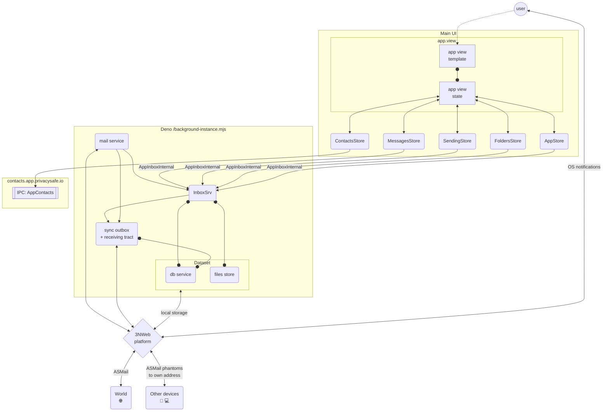

# Implementation

## Components

### Deno background component

Deno starts with the system (`launchOnSystemStartup`) and keeps receiving mail after the window is closed. It owns SQLite (`storage-db`), the labelled file store (`mail-app-files`), ASMail inbox/delivery, and OS notifications.

The database is in the device's **local** file system, so each device has a copy of its own. Those copies converge over ASMail: every local change is announced by a message the device addresses to the user's own address, and conflicts are resolved by last-write-wins per aspect of an entity. See [multi-device-sync.md](./multi-device-sync.md).

## Testing (approach, code will follow)

In making tests there is always a tension between scope/usefulness and cost of testing. The best test suite is testing system end to end without any mocks. End to end requires emulation of human that clicks/swipes/scrolls and observes graphics. Although doable with webdrivers, this is costly, and 3NWeb platform is not a usual browser, which we also want to implicitly test by running test app.

Vue's compositional code style creates a nice split in views between "human interaction" and "view's state" parts. We follow convention to name view's state creating functions starting with `use`, like `useAppView()`. Such functions are called in respective `vue` files, and in setups of `tests-app`'s test scenarios for "views' states". Mapping between view state and template is mostly declarative in vue template and it doesn't contain complexity that needs lots of testing. Unless, of course, one goes too crazy with CSS. And even then Vue conditionals for CSS can be coded in view's state, hence, be testable in simpler/cheaper test code without webdriver-like machinery.
