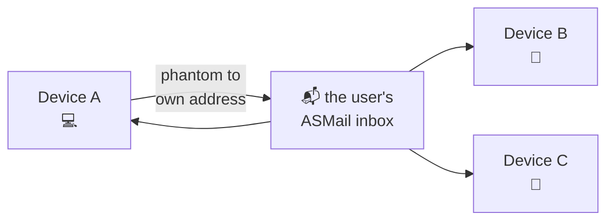

# Synchronization between the user's own devices

The app's data lives in the **local** file system of each device (see the
`storage-db` in [src-deno/dataset](../src-deno/dataset)), which is what makes the
app start without waiting on a server — and what leaves every device with a copy
of its own. This is how those copies converge.

There is no shared store involved. Each device announces every local change by
putting a message into ASMail addressed to **the user's own address**. An ASMail
inbox belongs to the user, not to a device, so all of the user's devices see it.
Such a message is a **phantom**: nothing about it is shown to the user, and the
device that sent it recognizes its own copy coming back and ignores it.



## What travels, and what does not

Every local change the app shows the user is synchronized. What is **not** sent:

| Not synchronized | Why |
|---|---|
| the record of an *incoming* message | its `msgId` is issued by the ASMail server and the inbox is shared, so every device derives the same record from the same message on its own. Sending it would duplicate bytes and risk two derivations of one record drifting apart |
| attachment previews (`thumbnails`) | a local cache; 10–40 KB of dataURL per attachment would treble the size of a phantom for something another device rebuilds in milliseconds — and for a file that is on some other device, never needs at all |
| bytes in `mail-app-files` | local by definition. Only the *record* of such an attachment travels, marked so that the receiving device can say where the file actually is |
| `AppState.lastReceivingTimestamp` | this device's own watermark over the shared inbox |

## Entities and aspects

Conflicts are resolved by **last-write-wins per aspect** of an entity, not per
entity and not per column. Two columns of `messages` mix independent sources of
truth:

| column | values | who writes them |
|---|---|---|
| `status` | `draft`/`sending`/`sent`/`error`/`canceled` | the GUI and `handleDeliveryProgress` — **the outcome of sending** |
| | `received`/`read` | the user — **whether the message has been read** |
| `mailFolder` | `inbox`/`draft`/`outbox`/`sent` | computed from the message's state — **where it belongs** |
| | `trash` (and future folders of the user's) | the user — **where they put it** |

Last-write-wins over either column whole breaks on both: a restore from the trash
on device B would clobber the `mailFolder` that a delivery outcome set on A, and
"has been read" and "the sending finished" would fight over one column.

So each is split by aspect ([sync-types.ts](../src-deno/types/sync-types.ts)):

- `content` — the record itself: subject, bodies, recipients, threadId, cTime,
  attachmentsInfo. **Outgoing only**;
- `read` — one bit, for an incoming message;
- `placement` — where the user put it;
- `delivery` — the outcome of sending, for an outgoing message;
- `folderProps` — a folder's name, icon, colour, position, path;
- `deleted` — a tombstone.

Every aspect is a function of the record and of nothing else. That is what lets
`diffMsgAspects()` work out what a change was about without the caller saying so
— which matters because the whole GUI writes through one `upsertMessage()`:
saving a draft, marking as read, cancelling a send, restoring from the trash. An
aspect picked by who is calling would silently miss the next caller.

### Placement in a reduced alphabet

`placement` **never names the system folder of outgoing mail**. It says one of
three things ([sync-types.ts](../src-deno/types/sync-types.ts)):

```ts
type MsgPlacement =
  | { at: 'home' }                       // wherever it belongs by its own state
  | { at: 'trash' }
  | { at: 'folder'; folderId: string };  // a folder of the user's
```

That is what makes a restore from the trash stop being a claim about a folder.
Device B says "this message is not in the trash", and where exactly it lands each
device works out from its own knowledge of the delivery outcome — see
`homeFolderOf()` in [msg-aspects.ts](../src-deno/services/sync/msg-aspects.ts),
which is the ONE copy of that rule. A second copy diverges on the first message
whose sending failed.

`delivery`, by contrast, names its `home` explicitly rather than leaving the
receiver to recompute it from `status`: the rule `handleDeliveryProgress()`
applies — every recipient refused → `outbox`, otherwise `sent` — knows something
about recipients that the phantom does not carry.

### The ordering token

`{ ts, deviceId }`. `ts` comes from a hybrid logical clock: `max(Date.now(),
lastSeen + 1)`, so a change made after seeing another device's change always gets
a greater stamp however far this device's wall clock is off. `deviceId` breaks
ties, and the tie-break is not optional: without a total order two devices would
pick different winners for concurrent changes and diverge for good.

An **equal** token loses. That single fact is what makes every recovery path of
the journal safe to take twice.

No guard about terminal statuses is needed here, unlike chat.app: a `sending`
phantom has a smaller `ts` than the `sent` phantom of the same sending, so it
loses by last-write-wins whichever order the two arrive in. And the one legal way
back from `sent` to `sending` — a re-send — honestly has a greater stamp, which
such a guard would have blocked.

## The outgoing half: why a journal

A change's ordering token is spent the moment the change is applied. If the
phantom is then lost — the component is closed, delivery cannot be reached, the
server refuses — nothing re-sends it, and the other devices never learn about the
change, because the token is already taken.

So the intent to send is written down together with the change:

```
change applied
  → announce(): token + journal row + aspect versions, ONE database operation
  → releasePending(): supersede → db.flush() → delivery.addMsg (200 ms apart)
  → the row STAYS, the flight is in the registry
      ├─ a clean outcome → the row is cleared
      └─ a failure       → the row stays, attempts += 1, a retry is armed
```

`addMsg()` only *queues* a message, which is why the row is not cleared on its
return: when the delivery then fails there would be nothing left to re-send from.
Which rows are inside a delivery is kept in memory rather than in a column — "in
a delivery" is only true relative to a live delivery record and a live progress
subscription, both of which belong to this process, and after a restart the
correct action is to send the row again.

A pass stops at the **first** refusal instead of walking the rest: handing a
message to delivery fails for one reason in practice — the server cannot be
reached — and that reason is the same for every row, so trying them all would
make each local change wait out one connection timeout per queued phantom.

**Superseding.** A row about one entity and one aspect the receiver applies whole
is dropped when a newer row of the same (entity, aspect) is in the journal. This
is what stops editing a draft from costing a delivery per save, and it rests on
one invariant: a `msg-record` phantom is built from the **stored** record at the
moment it is queued, never from a partial diff. Only then is a newer `content`
row a superset of an older one. A tombstone is never superseded, and neither is a
row covering more than one entity — such a row is described by the first version
written while carrying more than its own columns name.

Everything lives in **one** database. A second one would mean a second
`SQLiteOn3NStorage`, a second writer, and a second `flush()` in every path where
durability matters — and one database gives for free what the journal needs most:
the row and the token it belongs to land in one file write.

## The receiving half

`handleIncomingSyncEnvelope()`
([handle-incoming-sync.ts](../src-deno/services/sync/handle-incoming-sync.ts)),
with the checks in the order that matters:

1. **`msg.sender !== ownAddr`** → not a phantom but a message with a forged type.
   Nothing is applied and **nothing is removed** — it is not ours to remove. This
   check is first because it is cheap and because it is the only thing standing
   between this database and somebody else's input.
2. **the body does not parse** → a warning and a **deferred** removal. This
   deliberately differs from chat.app, which removes such a message at once: the
   format is new, and its first extension (v2) gives the situation "an older
   build on device A did not understand device B's phantom and took it away from
   device C". A fortnight of inbox space for an unread phantom is cheap; a lost
   change is not.
3. **`sourceDeviceId === appDeviceId`** — this device's own echo. Not applied (the
   change was applied locally when the phantom was queued) and **not removed**:
   the inbox is shared, and the other devices still need it. Scheduled for
   deferred removal.
4. otherwise — note the other device, observe the clock stamp (only on a first
   receipt, never on a replay of the buffer), apply, and schedule the removal.

### Instead of a resync protocol: read the message

A phantom about an incoming message this device has no record of does not need to
ask anybody. The carrier of that record cannot be lost here — it is the message
itself, in an inbox this device has direct access to. So instead of "ask a
neighbour, if it is awake and has budget left, and wait for an answer", one
`w3n.mail.inbox.getMsg(msgId)`: no ASMail traffic, no request/response protocol,
works with every other device switched off. One attempt per msgId per session — a
message that is not there does not appear because it was asked for twice.

The one case it cannot cover is a message already removed from the server, where
a resync would not have helped either.

### The orphan buffer

What is left for the buffer is three cases: `getMsg` failed on the network; a
delivery started and never finished, so the message is listed but not readable;
and an aspect phantom arriving ahead of its own `msg-record` — which is
**ordinary**, two phantoms of one device travelling as separate deliveries 200 ms
apart with no guarantee of order. The third justifies the table on its own.

The drain goes by the time of the **change**, not of the buffering: with conflicts
resolved per aspect, applying in arrival order would leave an older change as the
last one written.

## Deleting, and not resurrecting

Removal of an ordinary message from the server stays **immediate**. Only the
removal of phantoms is deferred. Suppose A deletes message M for good and takes it
off the server at once:

- if B already has a copy of M, B gets the tombstone — the journal repeats the
  phantom until a delivery confirms it — and deletes its copy;
- if B has no copy, M does not exist for B and will not appear: it is not on the
  server.

Either way the two converge, and the cost of deferring is real: a message deleted
"for good" with attachments of up to 200 MB would hold mailbox quota for a
fortnight.

What that makes obligatory is the tombstone check in `persistIncomingMail()`: the
race is possible, B having listed the inbox before A's `removeMsg` went through.
No token comparison there — an incoming `msgId` is issued by the server once, so
there is no such thing as a newer arrival of the same message, and the tombstone's
presence is the whole answer.

**`TOMBSTONE_TTL_MS` is a day longer than `INBOX_REMOVAL_DELAY_MS`**, and that gap
is the point: a tombstone is the only thing keeping a scan from resurrecting
deleted mail, so it has to outlive everything that could still bring the message
back. With equal windows there is a gap where the tombstone is already collected
while `removeMsg` has not gone through — the server refused, the device was off —
and the message comes back from the dead.

A `removeMsg` that fails on the network is scheduled for another attempt rather
than sinking in `Promise.allSettled`, where before a refusal meant the message
stayed in the inbox for good.

## Attachments between devices

Bytes do not travel. Three cases, and only one of them is fully available
([record-mapping.ts](../src-deno/services/sync/record-mapping.ts)):

1. **an attachment of a forwarded incoming message** (`type: 'origin'` with an
   `originMsgId`): its bytes are in a message in the **shared** inbox, and
   `originMsgId` is that inbox msgId — the same on every device. Another device
   reads them, and the record is deliberately **not** marked;
2. **a symlink to a file on the author's disk** (`external: true`);
3. **a copy in `mail-app-files`**.

(2) and (3) arrive marked `hasNoLocalSource`, and everything that could read one
says so instead of reporting a broken file. `id` is cut out in all three: it
points into another device's file store, where it can *collide* with a local id
and hand the user someone else's file.

Availability is decided in one place,
[attachment-availability.ts](../shared/utils/attachment-availability.ts), and the
order of its checks is its content: `hasNoLocalSource` first, because a record
from another device may carry `type: 'origin'` and `originMsgId` as well.

`messages.originDeviceId` is needed apart from the per-attachment flag: a
synchronized record with `status: 'sending'` would otherwise show "cancel /
retry" on another device, where pressing cancel would send a **false**
`'canceled'` back to the device that is actually sending and cancel no delivery at
all. It is kept in a column and not in `jsonBody`, which
`outgoingMsgViewToOutgoingMsg()` flattens into the body of the message sent to the
correspondent — the device id would leak out.

## The indicator

The decisions live in pure functions with `now` passed in
([sync-activity.ts](../src-deno/services/sync/sync-activity.ts)); the timers are a
thin shell. Nothing is shown before 600 ms of continuous work — an ordinary action
journals a phantom and hands it to delivery inside tens of milliseconds — and once
shown it stays 1200 ms, quiet having to hold 500 ms before it goes.

`stalled` is set by a pass actually failing rather than by a timeout on
inactivity: "Synchronizing…" hanging over an unreachable server tells the user the
opposite of the truth. The outcome is reported by the pass itself and not by
whoever started it: passes come from `announce()`, from the start and from the
retry timer, and a report from one of those alone would freeze the indicator on
somebody else's reading.

**While this device has never seen a phantom from another device, nothing is
reported at all.** A user with a single device has no synchronization to be told
about, and the phantoms in their inbox are their own copies coming back. Counters
are kept regardless, so the moment that turns true the indicator shows the real
state without a restart.

## The start-up replay, and why it updates the window once

A device that was off comes back to a backlog of phantoms which is, quite
literally, the history of each message it touches: several saves of a draft, then
`sending`, then `sent`. Applying them is correct in any order — last-write-wins
per aspect settles the final state — but *reporting* each step walks the row
through that whole history in front of the user, and a message that has long been
in Sent appears in Draft on the way.

So `createInboxEvents()` has a window
([events.ts](../src-deno/services/inbox-service/events.ts)):
`beginBulkReplay()` / `endBulkReplay()` bracket the whole of `mailService()` in
[index.ts](../src-deno/index.ts) — which covers both the catch-up scan of the
inbox and the backlog of deliveries that follows it. While it is open, `message`
and `folder` events are held back and a single `{ entity: 'lists', event:
'reload' }` goes out at the end. `sending`, `app-state` and `sync` are **not**
held back: the replay is exactly what the indicator is there to explain.

The window needs no plumbing because there is exactly one `createInboxEvents()`
call and every emitter — `applyMsgChanges`, `persistIncomingMail`,
`deleteMessagesWithGc`, `handleDeliveryProgress` — holds a reference to that one
`emit`.

**"Re-read" and not "here is the batch", and necessarily.** The service answers
requests from the moment it is built, which is *before* the replay begins, so the
GUI takes its own first snapshot of the lists in the middle of it. Nothing can
tell what that snapshot already holds; only a re-read is sound.

That is also why the GUI subscribes **before** it reads the lists
([useAppPage.ts](../src/common/composables/useAppPage.ts)), and why the queue it
subscribes into is not drained until the read is done. Subscribing afterwards left
a gap: a change applied between the read and the subscription reached neither, and
stayed invisible until the next change to the same message. Draining before the
read would be no better — `getMessages()` replaces the list wholesale with a
snapshot taken earlier, and would wipe what had just been applied.

The window is open only at start-up. A live backlog — the device comes back online
and the subscription brings phantoms one after another — is still reported
per change. Those arrive spread over time rather than as a retelling of
accumulated history, so they do not produce the same walk.

## Diagnosing it

The indicator is for the user. What this is actually debugged by is the log:

- `appDeviceId` at every start, with the sync state next to it: journal rows,
  buffered phantoms, deferred removals, watermark, whether another device has been
  seen;
- the catch-up line, with own phantoms counted apart:
  `Catch-up: watermark …, listed 41 since …, 33 mail, 8 sync (8 of them from this device app-xxxxx), 0 failed`.
  **"8 of 8 own" on two devices at once** is the only outward sign that both
  copies are reading one data folder — a misconfiguration that looks exactly like
  broken synchronization and that nothing else in the log contradicts;
- `debug` on every application, naming the source device, the event and the stamp;
- `error` on a phantom whose delivery failed — the one line that names a change
  which did not reach the user's other devices.

For trying it by hand, [run-test-mac2.sh](../run-test-mac2.sh) starts the first
test user a second time in a data folder of its own.

## Deliberately out of scope

- **A UI for creating folders.** The mechanics of the `folder` entity are here and
  `InboxSrv` exposes `addFolder`/`deleteFolder`, but there is no way to make a
  folder in the app, so no traffic flows over that entity yet.
- **A resync request/response protocol** — reading the message out of the shared
  inbox covers it (see above); the fields for an answer are reserved in
  `SyncedMsgRecord`.
- **A sweep that cancels stuck deliveries.** The only net under a delivery whose
  outcome never arrives is `PHANTOM_FLIGHT_GRACE_MS`, and it is 5 minutes rather
  than chat.app's 7 precisely because it is the first net here and not the second.
- **Batching several changes into one ASMail message.** Superseding cuts the
  number of deliveries; each surviving row still travels as its own message.
- **Attachment bytes between devices** — only the mark and a clear message travel.
- **Synchronizing previews** — a local cache that rebuilds itself.
- **Detecting two copies of the app on one data folder.** With the database in the
  local FS the problem is wider than chat.app's: two copies clobber the whole
  `storage-db`. What is here is the device id in the log and the separate count of
  own phantoms in the catch-up line.
